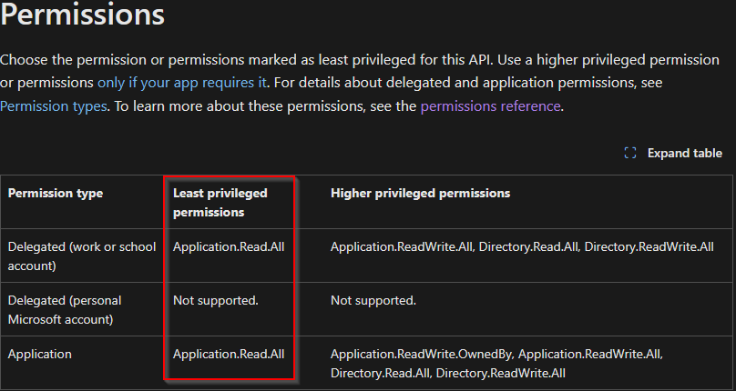
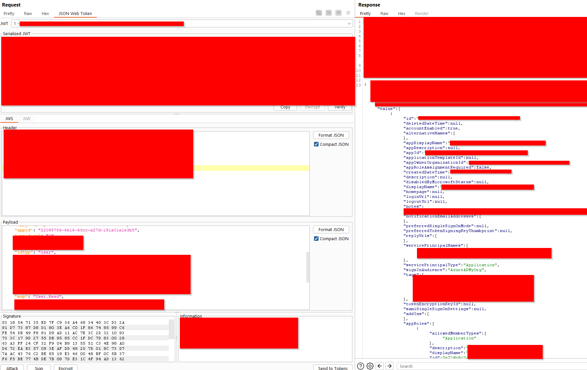

# The Curious Case of MSGraph JWT and

## tl;dr

Access tokens issued for a **subset** of Microsoft first-party applications for MSGraph contained minimal scopes like User.Read — but had much much more access. For example with a User.Read scope using the Microsoft To-Do clientId had permissions to enumerate **every user in the tenant, including emails, titles, and phone numbers. Additionally it can view every servicePrincipal and associated data (appRoles, urls,etc.), as well as enumerate the entire tenant contact list, etc. despite it being explicitly not allowed in Microsft Documentation**

This behavior indicates that **JWT scope claims do not always reflect the actual permissions granted by the token** and expands the attack surface for recon, contradicting documented behavior. It may also suggest broader misconfigurations across clientId/resource pairs.

**In my opinion, the key impact—beyond being interesting—is that it undermines defensive assumptions. Organizations implementing Conditional Access Policies may misjudge the risk of certain apps based on their documented scopes, allowing indirectly "privileged" apps to slip through MFA or managed device requirements. Also during Incident Response, logged scopes may falsely downplay an attacker’s actual access, making detection and scoping more difficult. This also appears to be an MFA bypass if the tenant has any CAP exceptions as MSGraph will allow user.read scope tokens since they are not "privileged"**

This was reported to MSRC on **July 8** and was considered a non issue.

If you are looking for some awesome azure content Charles Hamilton at [TrueCyber](https://truecyber.world/) is going through a great azure series right now. 

## Introduction

Microsoft Graph generally follows standard OAuth practices: access tokens include JWT claims like scp (scopes) and roles, which indicate what the token is authorized to do. For first-party apps, Microsoft often "pre-consents" certain permissions on behalf of tenants.

However, Microsoft’s implementation of OAuth has long included **nonstandard behaviors** , as documented in prior research:

+ [SecureWorks: Family of Client IDs](https://github.com/secureworks/family-of-client-ids-research)
+ [Troopers 2025 talk by Dirk-jan and Fabian](https://troopers.de/troopers25/talks/tfsfqs/)

This context eventually led to the discovery: **JWT scopes and Preconsented permissions can be misleading — and in some cases, outright inaccurate**.

## Accidental Discovery

While editing FindMeAccess to automate post-authentication Graph enumeration on a test tenant, I included hitting high-value endpoints (like /users) if authentication was successful. Unexpectedly, tokens obtained via the **Microsoft To-Do** application (22098786-6e16-43cc-a27d-191a01a1e3b5) returned **valid data from /users** , even though the only scope in the JWT was User.Read.

Cross-referencing with EntraScopes and the PreConsent Explorer confirmed the To-Do app was only pre-consented for User.Read. Additionally, Microsoft's documentation states that User.Read should _only_ return information for the signed-in user — not allow tenant-wide user enumeration.

_List Users Permission Requirements_

And yet, the token worked on /users, returning the **entire directory**.

## Escalating Impact

After scratching my head for a few days I wondered what other endpoints I could hit with that access token. After some trial and error I could hit some interesting endpoints like /contacts and /servicePrincipals. According to Microsoft documentation I should need OrgContact.Read.All for /contacts and Application.Read.All for /servicePrincipals. There are a few others I was able to access with a User.Read scope but it will depend on the clientId you have access to.

_List Service Principals Permission Requirements_

## Other Interesting Tidbits

While I have not exhaustively mapped the full set of affected clients or endpoints, this strongly suggests:

+ There may be additional clientId/resource combinations with unintended privileges.
+ Attackers can sometimes abuse apps to perform recon , even if scope claims look harmless.
+ Tenant defenders relying on scopes for CAP or IR may miss these abuses.
+ Be very wary of CAP exceptions
+ There may be use cases beyond reconnaissance

## Conclusion

This issue demonstrates a deeper problem in Microsoft’s handling of Graph app permissions: **token scopes cannot be explicitly trusted as an accurate indicator of access**. I highly recommend others with test tenants to explore other permissions/scopes/MSGraph endpoint checks and do not blindly trust the scopes or preconsented permissions

